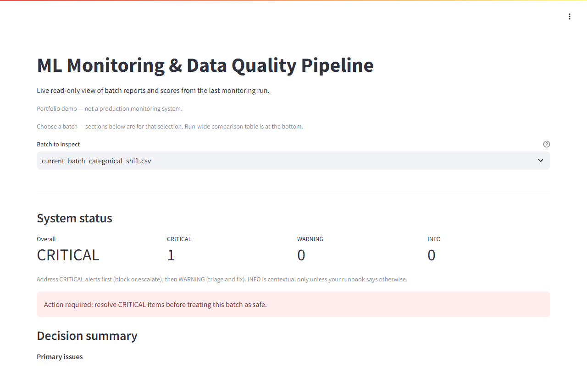

# ML Monitoring & Data Quality Pipeline

[](https://github.com/vahdetkaratas/ml-monitoring-data-quality-pipeline/actions/workflows/ci.yml)

Batch monitoring demo for **tabular** scoring data: validate incoming CSV batches against a JSON schema, compare them to a **reference** dataset (numeric and categorical drift, prediction behaviour), and emit **JSON reports**, a **CSV overview**, and a **static HTML run summary**. A **Streamlit** app reads those artifacts for an interactive viewer.

## Live demo

**Interactive viewer (portfolio / recruiter):** [monitoring.vahdetkaratas.com](https://monitoring.vahdetkaratas.com/)

**Commercial introduction (static shell):** [ml-monitoring.vahdetkaratas.com](https://ml-monitoring.vahdetkaratas.com/)

**Streamlit demo (VahdetLabs):** [monitoring.vahdetlabs.com](https://monitoring.vahdetlabs.com/)

Streamlit is the **interactive** UI (batch selection, status, alerts, charts). The **static HTML** file `artifacts/reports/monitoring_run_report.html` is generated by the pipeline (`run_full_monitoring`), not by Streamlit—open it from the repo or locally after a run.



To refresh this screenshot: `pip install playwright`, `playwright install chromium`, then `python scripts/capture_streamlit_screenshot.py` (optional: `STREAMLIT_DEMO_URL`).

## Static overview shells (dual-brand)

Optional static shells are rendered from `shell/` into `layout-shell/` (recruiter framing) and `layout-shell-commercial/` (**commercial** framing); deploy the commercial build to **`ml-monitoring.vahdetkaratas.com`**. The Labs Streamlit app is hosted separately at **`monitoring.vahdetlabs.com`**. Recruiter Streamlit viewer (portfolio): **`monitoring.vahdetkaratas.com`**.

## What this is

- A **Python pipeline** you run locally: CSV in → reports under `artifacts/`.
- A **portfolio-sized** example: synthetic reference plus five scripted “current” scenarios (clean, missing values, numeric drift, categorical shift, prediction shift).
- **Automated tests** (`pytest`) and **CI** on `main` (see `.github/workflows/ci.yml`).

## What this is not

- Not a live inference API, feature store, or full orchestration platform.
- Not a multi-tenant monitoring product—it's a clear, testable slice of validation + drift + reporting.

## Requirements

- **Python 3.10+**
- Install: `pip install -r requirements.txt`

Paths resolve from the **repository root** (`src/utils/paths.py`), not the shell’s current working directory, so the CLI and Streamlit agree once `src` is importable. Run commands from the repo root.

## Sample data and artifacts (in git)

**`data/**/*.csv`** and **`artifacts/**`** are committed as a small, reproducible demo so you can open the HTML report or Streamlit without regenerating files. For a clean run from source only, remove generated `data/reference/`, `data/current/*.csv`, and `artifacts/`, then run simulation and the pipeline below.

## How to run — simulation

Creates `data/reference/reference_dataset.csv` and five `data/current/current_batch_*.csv` files:

```bash
python -m src.simulation.run_all_simulation
```

## How to run — monitoring pipeline

Reads the reference dataset and every `data/current/current_batch_*.csv`, then writes:

- `artifacts/reports/report_<batch>.json` — validation, drift, prediction summary, alerts  
- `artifacts/reports/monitoring_overview.csv` — one row per batch  
- `artifacts/reports/monitoring_run_report.html` — static summary of the full run  
- `artifacts/drift/drift_<batch>.json` — per-feature drift metrics  

```bash
python -m src.pipeline.run_full_monitoring
```

## How to run — Streamlit viewer

After the pipeline has run at least once:

```bash
streamlit run src/demo/streamlit_app.py
```

Opens on the URL Streamlit prints (default `http://localhost:8501`). The app uses `monitoring_overview.csv`, per-batch JSON, drift JSON, and batch CSVs under `data/current/`.

## Outputs (quick reference)

| Path | Content |
|------|--------|
| `data/metadata/schema_definition.json` | Column contract (types, ranges, categoricals) |
| `data/reference/reference_dataset.csv` | Baseline for drift / prediction monitoring |
| `data/current/current_batch_*.csv` | Incoming batches |
| `artifacts/reports/report_*.json` | Full report + alerts |
| `artifacts/reports/monitoring_overview.csv` | Batch-level status table |
| `artifacts/reports/monitoring_run_report.html` | Static HTML run summary (all batches) |
| `artifacts/drift/drift_*.json` | PSI / KS / categorical metrics |

## Tests

```bash
python -m pytest tests -q
```

Same suite runs on **GitHub Actions** for pushes and pull requests to `main`.
